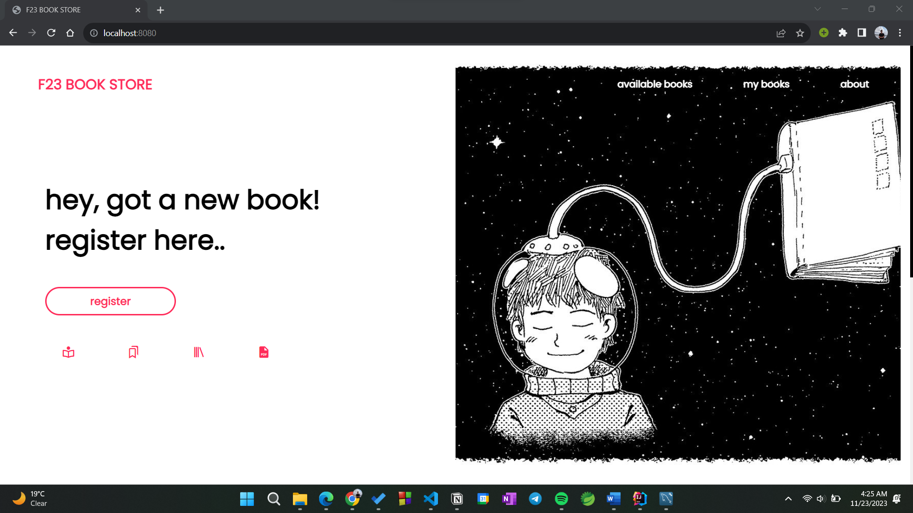
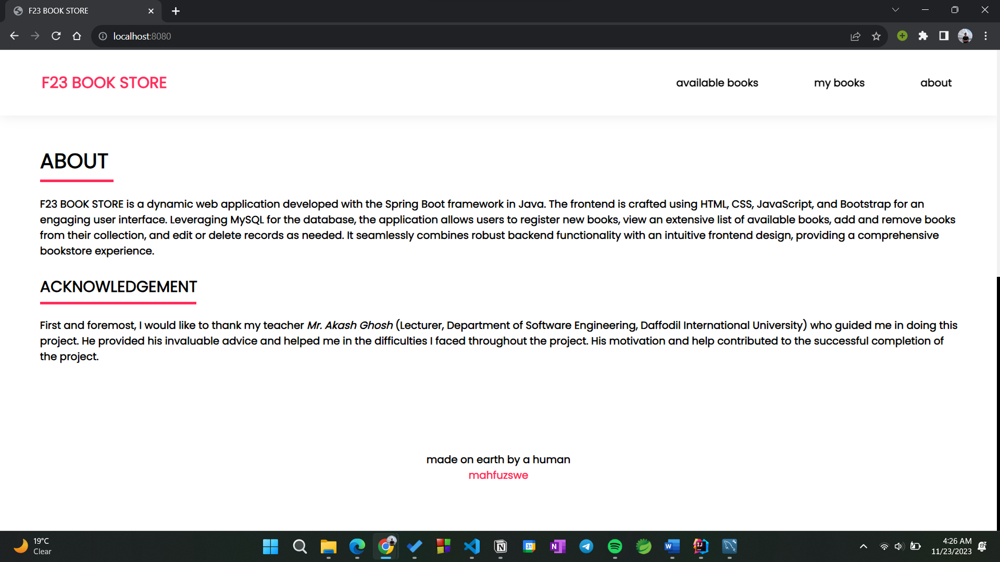
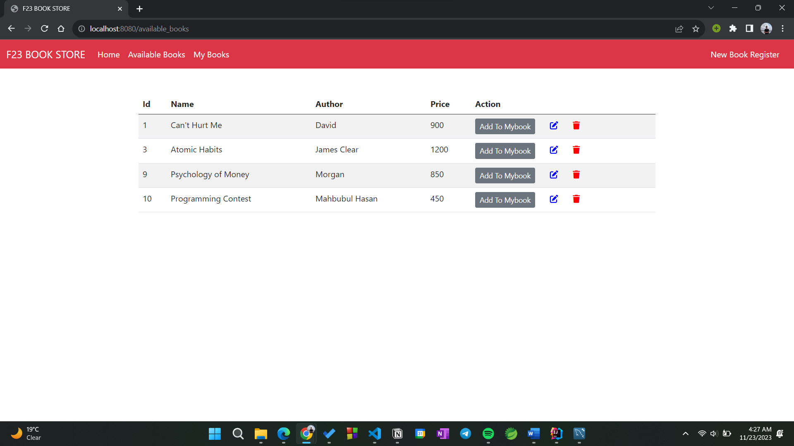
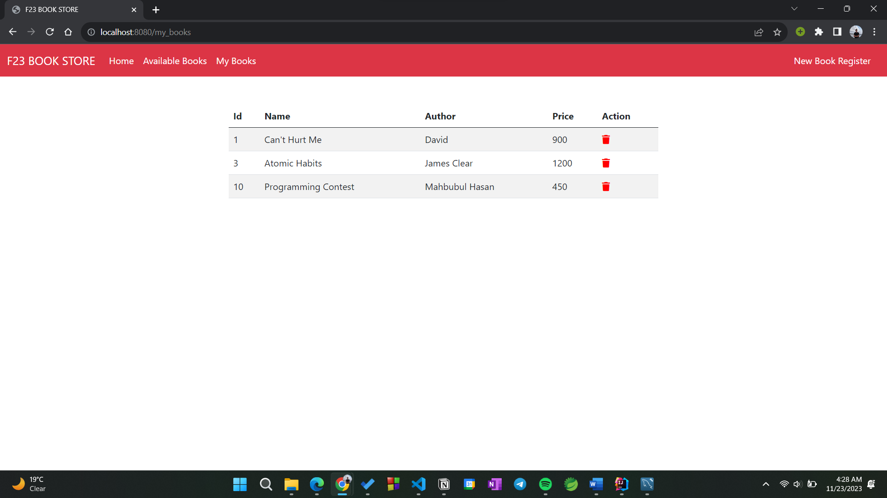
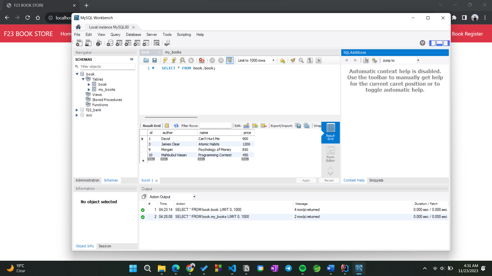
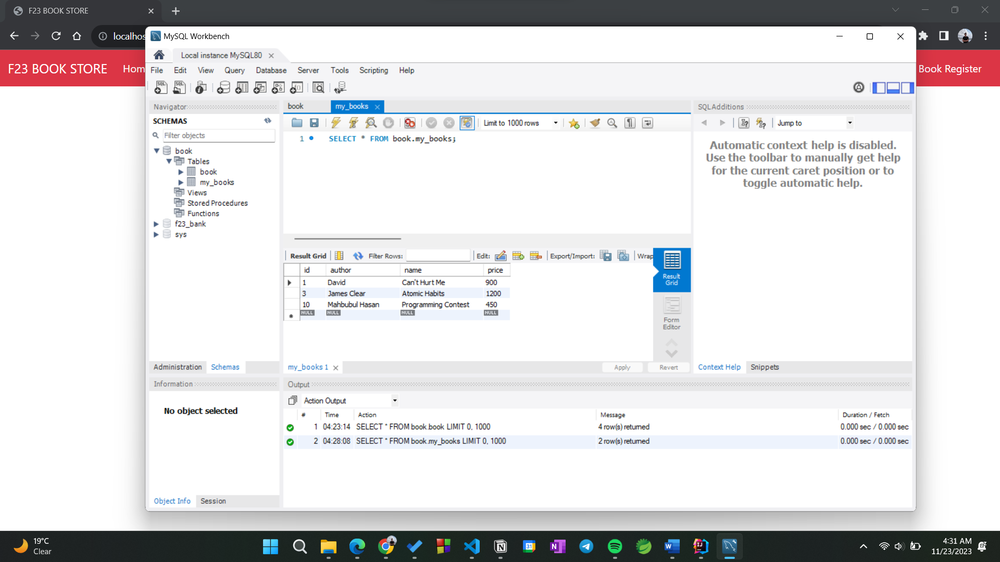

# F23_BOOK_STORE

> #### A dynamic web application developed with the Spring Boot framework in Java and MySQL for database.

## Features

- [x] Register new books.
- [x] View an extensive list of available books.
- [x] Add and remove books from the user's collection.
- [x] Edit or delete book records as needed.

## Snapshots

### Home

### Available Books

### My Books

### Available Book Records

### User's Book Records

### Video Presentation on YouTube

## Conclusion

- F23 BOOK STORE promises an efficient and user-friendly bookstore experience. Leveraging Spring Boot and MySQL, the project integrates modern web technologies for seamless CRUD operations. With a dynamic interface and robust functionalities, it caters to book enthusiasts, providing a comprehensive and enjoyable platform for book management and exploration.
